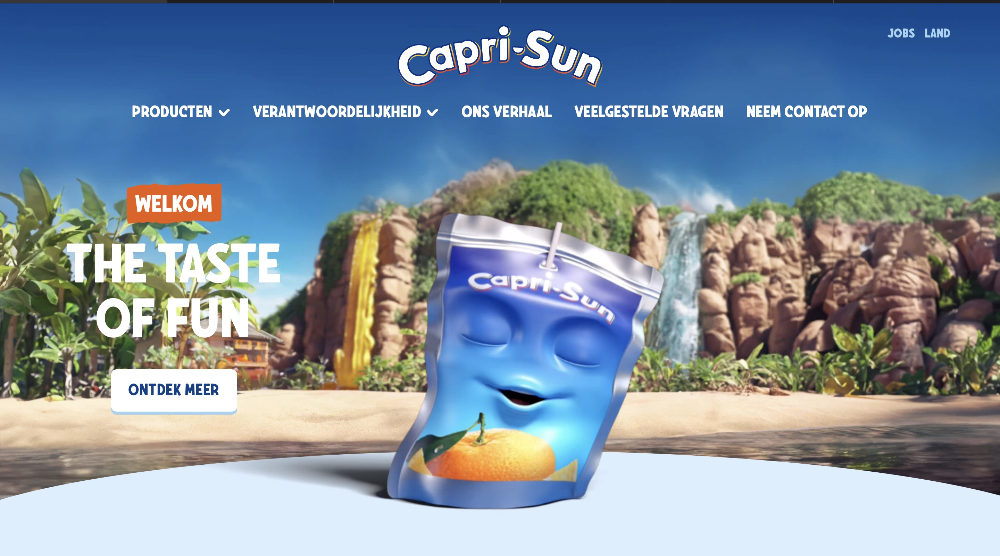
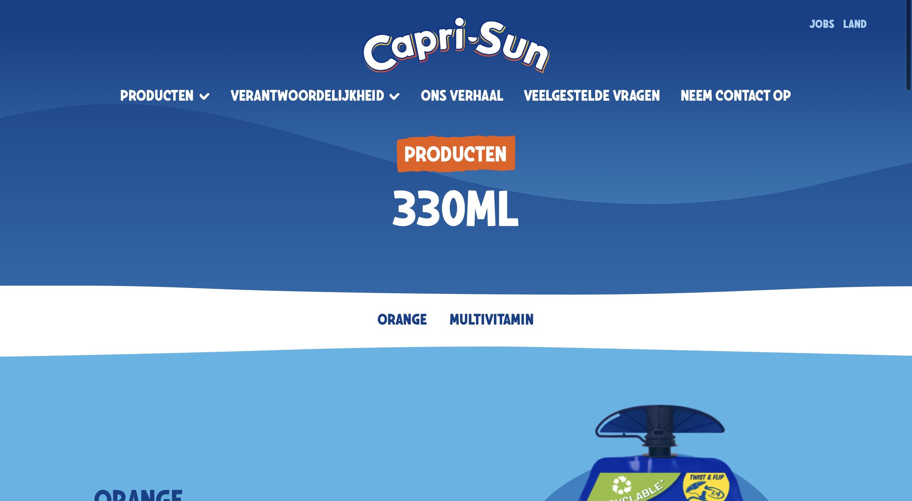

# Procesverslag
Markdown is een simpele manier om HTML te schrijven.  
Markdown cheat cheet: [Hulp bij het schrijven van Markdown](https://github.com/adam-p/markdown-here/wiki/Markdown-Cheatsheet).

Nb. De standaardstructuur en de spartaanse opmaak van de README.md zijn helemaal prima. Het gaat om de inhoud van je procesverslag. Besteedt de tijd voor pracht en praal aan je website.

Nb. Door *open* toe te voegen aan een *details* element kun je deze standaard open zetten. Fijn om dat steeds voor de relevante stuk(ken) te doen.

## Jij

  
uitwerken voor kick-off werkgroep

  ### Auteur:
Sharon Sonku
  #### Je startniveau:
Rood
  #### Je focus:
responsive 

## Je website

  
uitwerken voor kick-off werkgroep

  ### Je opdracht:
https://www.capri-sun.com/nl/ons-verhaal/
  #### Screenshot(s) van de eerste pagina (small screen): 
  hier de naam van de pagina  
  

  #### Screenshot(s) van de tweede pagina (small screen):
  hier de naam van de pagina  
  
 

## Toegankelijkheidstest 1/2 (week 1)

  
uitwerken na test in 2e werkgroep

  ### Bevindingen
  Lijst met je bevindingen die in de test naar voren kwamen:
*hij kan verspringen
*de meeste fotos hebben geen alt attribute
*bij een link zegt het niet waar het heen gaat

## Breakdownschets (week 1)

  
uitwerken na afloop 3e werkgroep

  ### de hele pagina: 
  

  ### dynamisch deel (bijv menu): 
  

  ### wellicht nog een dynamisch deel (bijv filter): 
  

## Voortgang 1 (week 2)

  
uitwerken voor 1e voortgang

  ### Stand van zaken
  die halve boog krijgen en later overlopen in mijn 1ste section

  ### Agenda voor meeting
  samen met je groepje opstellen

  | Audrey                       | Kaylee                                   | Jelle         | student 4        |
  | Juiste tags gebruikt?        |svg omzetten?
  | Beter in html of css?        | hoe je een video conunite laat afspelen              | ---          | ---              |
  |                              | en dit                                   | en ik dit    | en dan ik dat    |
  |                              | dit als er tijd is | nog een punt | dit wil ik zeker |
  | ...            | ...                | ...                                 | ...              |

  ### Verslag van meeting
Hier zijn de punten uit je tekst zonder wijzigingen:

1. **Nette semantische HTML**: Gebruik semantische HTML-elementen zoals `<header>`, `<footer>`, `<section>`, enz.

2. **Probeer sections te gebruiken i.p.v. de div's**: Gebruik `<section>`-elementen om inhoud te structureren in plaats van alleen `
`-elementen.

3. **Probeer consistent te blijven met de class names**: Zorg ervoor dat class names in je CSS en HTML consistent zijn.

4. **Probeer zo min mogelijk breaks te gebruiken**: Gebruik ` `-tags alleen als het echt nodig is.

5. **Text kan je ook stijlen door gebruik te maken van margins en centeren door text-align: center**: Gebruik CSS `margin` en `text-align: center` om tekst uit te lijnen en ruimte toe te voegen.

6. **Je script kan je boven in de head neerzetten**: Plaats je `<script>`-tags in de `<head>` van je HTML-document om te zorgen dat ze niet de rendering blokkeren.

7. **Je `<footer>` element moet wel binnen de body net zoals je header element**: Zorg ervoor dat het `<footer>`-element binnen de `<body>` staat, net als het `<header>`-element.

8. **Probeer 1x een `<h1>` te gebruiken**: Gebruik één `<h1>`-element per pagina voor de hoofdheading.

<!-- command shift c is om alle elementen te zien ! -->

## Voortgang 2 (week 3)

  
uitwerken voor 2e voortgang

  ### Stand van zaken
Ik had moeite met het schalen van de grids. ze kwamen niet zoals ik wou in beeld.
Na ee paar keer over mijn code heen kijken zag ik dat ik een typfout had gemaakt waardoom de grid niet reageerde.
  ### Agenda voor meeting
  samen met je groepje opstellen

  | Audrey     | Kaylee          |  Jelle    | student 4        |
  | ---            | ---                | ---          | ---              |
  | dit bespreken  | en dit             | en ik dit    | en dan ik dat    |
  | en dat ook nog | dit als er tijd is | nog een punt | dit wil ik zeker |
  | ...            | ...                | ...          | ...              |

  ### Verslag van meeting
  hier na afloop snel de uitkomsten van de meeting vastleggen

1. Gebruik semantische HTML: Maak gebruik van <section>-elementen in plaats van 
-elementen om de structuur duidelijker te maken.
2. Consistentie in class-namen: Zorg ervoor dat de naamgeving van je classes door de hele code consistent blijft.
3. Beperk het gebruik van  -tags: Stijl je tekst liever met margin voor witruimte en text-align: center om tekst te centreren.
4. Plaats je <script>-tag in de <head>: Zorg ervoor dat je scripts bovenaan de pagina worden geplaatst.
5. Structuur van <header> en <footer>: Zorg ervoor dat zowel het <footer>- als het <header>-element binnen de <body>-tag staan.
6. Gebruik slechts één <h1>-tag: Beperk het gebruik van <h1> tot één keer per pagina voor een duidelijke hiërarchie in de kopteksten.

## Toegankelijkheidstest 2/2 (week 4)

  
uitwerken na test in 9e werkgroep

  ### Bevindingen
 mijn navvoor mobiele telefoon kwam niet goed tevoorschijn.

## Voortgang 3 (week 4)

  
uitwerken voor 3e voortgang

  ### Stand van zaken
Ik heb alles gekregen waar ik het wil hebben, alleen werkt mijn slider niet 100%. hier ga ik dus naar kijken. Ik kan de 1 ste slider niet verder klikken maar de 2e wel ik weet niet wat er fout aan is.
  ### Agenda voor meeting
  samen met je groepje opstellen

  | student 1      | student 2          | student 3    | student 4        |
  | ---            | ---                | ---          | ---              |
  | dit bespreken  | en dit             | en ik dit    | en dan ik dat    |
  | en dat ook nog | dit als er tijd is | nog een punt | dit wil ik zeker |
  | ...            | ...                | ...          | ...              |

  ### Verslag van meeting
  hier na afloop snel de uitkomsten van de meeting vastleggen
hier was ik niet bij ik zat ziek thuis.

## Eindgesprek (week 5)

  
uitwerken voor eindgesprek

  ### Je uitkomst - karakteristiek screenshots:
  

  ### Dit ging goed/Heb ik geleerd: 
  Korte omschrijving met plaatjes

  

  ### Dit was lastig/Is niet gelukt:
  De animaties toevoegen is mij niet gelukt. Ik kreeg sommige wel in beeld maar dan werden alle andere elemnten verschoven.

  

## Bronnenlijst

  
continu bijhouden terwijl je werkt

  Nb. Wees specifiek ('css-tricks' als bron is bijv. niet specifiek genoeg). 
  Nb. ChatGpT en andere AI horen er ook bij.
  Nb. Vermeld de bronnen ook in je code.

  1. 
  2. bron 2
  3. ...

